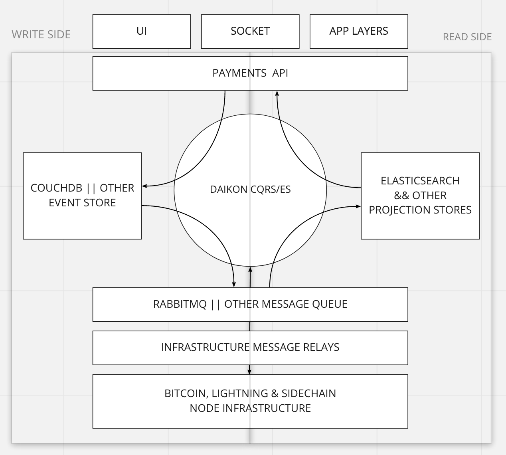
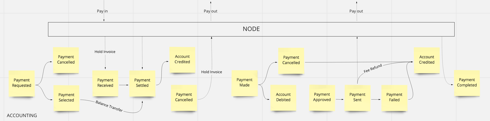

# Satbased

## API Documentation

Read the [usage](usage.md) for API interaction instructions, and select from the menu for furth explainations about each available endpoint.

## Architecture
The backend is built on a custom open source CQRS/ES framework [Daikon-CQRS](https://github.com/daikon-cqrs) with ADR web framework wrapper which has been in semi-active design and development for several years. This is a lengthy subject but this is becoming the ideal architecture for building apps around bitcoin and other scalable asynchronous systems.

The default technologies used are easily switchable:
 - CouchDb3 as an immutable event store and source of truth
 - Elasticsearch7 as the standard projection document store and search engine
 - RabbitMQ3 as the persistent message queue for asynchronous processing bitcoin, lightning or other infrastructure messages
 - Nginx in a reverse proxy configuration for serving the API.
 - Docker for provisioning

## Profiles
The classical security Profile abstraction has configurable roles and ACL at the route and resource level. Authentication is done via Bearer token HTTP headers containing a JWT and XSRF token.

## Accounts
The Account model extends the standard Profile and offers a simple double entry ledger for registered visitors. Accounts are simply credited and debited and the entire system accounting base is in millisats throughout.

## Payments
The primary abstraction on demo here is the Payment resource. It simplifies the Invoice/Transaction/Payment abstractions in Bitcoin and Lightning into a single Payment concept with two discrete state machines representing payments in (starting with PaymentRequested) and payments out (starting with PaymentMade) of an Account.

Payments also have reference fields so when payment state is proceeded, other layers of an application can react to these events. Again accounting base is millisats (msat).

### Payment Requested (In)
Payments are specified as an amount and an optional description. The recipient of the request (which can be the payment requester) can select the payment type to pay with from enabled services, in this case Bitcoin, Lightning or an account balance transfer. Therefore one can send money to yourself to add to balance, or if presenting the payment to a customer, the customer can select how to pay.

Some limits are configured on services, for example minimum bitcoin sending amount can be 1000sat, whereas for lightning the minimum can be 100sat.

Once a payment method is selected, a transaction is generated on the payment. If the payment method is transfer, then the balance is transferred instantly, otherwise the transaction details are generated by the relevant node for presentation to the payer. Transaction defaults can be configured by the system admin.

When a payment is received, the backend watches for notifications from infrastructure, applies confirmation rules, and ultimately credits the receiver account if payment succeeds.

### Payment Made (Out)
An account must have sufficient balance before payments can be sent out and the service to use is also required, as is a related address or request/id to pay to.

When the payment is made the account is debited and a transaction is generated on the payment. A background worker then asynchronously attempts to send the payment. The payment is completed or failed, and account credited in case of failure.

The transaction is fully configurable based on the service, and can offer feeLimit, or maxFeePercent etc. depending on the service type. The transactions can be abstracted across different service types thus making lnd/lightning or bitcoin/elements well abstracted.